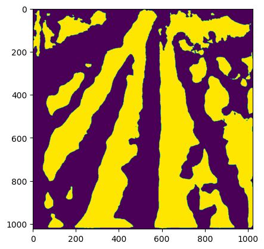

# Crop-Lane-Detection

This repo contains two implementations of a pretrained backbone network (like Resnet50)
used in a UNet architecture.

## Custom Implementation

We utilized the [timm models](https://pypi.org/project/timm/) for the pre-trained encoders. We later built
the traing framework, the custom dataloaders and the augmentations necessary to train the
UNet on a smaller dataset.

- The end-to-end script is contained in a single ipynb called ```crop_lane_detection.ipynb```
- Sample Datasets are present in the ```sample_data``` folder
- We also modified an existing annotation tool to meet our requirements. It uses the
  Segment-Anything model along with user inputs (clicks) to generate segementation masks
- The annotation tool can be found here: [SALT](https://github.com/sushanthj/salt)

## Installation

Clone the repository and install the required packages as shown below

```bash
git clone https://github.com/jiyooonp/Crop-Lane-Detection.git

cd Crop-Lane-Detection

pip3 install -r requirements.txt
```

## Sample Dataset

The sample dataset contains the images and masks required for training. Examples of the images
and masks used in training are shown below:

### Input Image


### Ground Truth Mask


### Test Outputs from Trained Model



## Reference Implementation

- The reference implementation which we first tried is the ```unet_with_res50_segmentation.ipynb```
- This script uses the training functions and dataset classes present in the ```backbones_unet```
  package
- The backbones_unet package backbone networks such as ConvNext, ResNet, EfficientNet, DenseNet, RegNet, and
  VGG... which are popular and SOTA performers, for the UNet model.
- It is possible to adjust which layers of the backbone of the model are trainable parametrically.